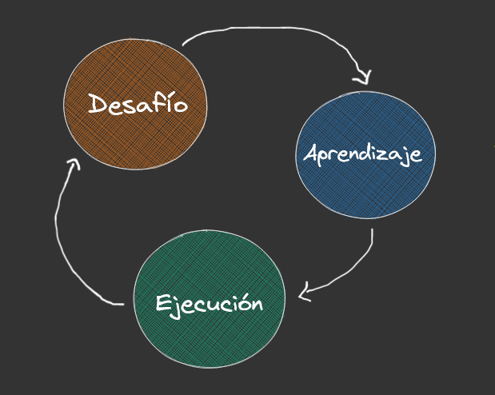

# ----------------------------PARAMETA----------------------------
## Proyecto de Prueba Técnica - Desarrollo de API REST con Spring Boot

Este proyecto de prueba técnica que aborda el desarrollo
de una API REST utilizando Spring Boot. El proyecto se centra en 
crear una API que realice operaciones CRUD y aplique validaciones especiales en 
las solicitudes POST. El objetivo es demostrar mi enfoque para resolver problemas, 
el aprendizaje adquirido durante el proceso y la solución implementada.

### Enfoque de Desarrollo:

Mi enfoque para desarrollar la API se dividió en tres etapas:

#### 1. Desafío Identificación del Problema:
* Desarrollo de una API REST con Spring Boot.
* Implementación de operaciones CRUD, con énfasis en la solicitud POST.
* Aplicación de validaciones en las fechas y atributos de los empleados.
* Validación de la mayoría de edad de los empleados.
* Cálculo del tiempo de vinculación y edad actual de los empleados.

#### 2. Aprendizaje:
* Investigación de las mejores prácticas para el desarrollo de APIs REST con Spring Boot.
* Aprendizaje sobre validación de datos y manejo de bases de datos MySQL.
* Comprensión de cómo calcular intervalos de tiempo y edades basados en fechas.

#### 3. Solución Ejecución:
 * Uso de Spring Boot para crear la API REST.
 * Implementación de anotaciones para validar los datos de entrada.
 * Desarrollo de lógica para calcular los tiempos y edades requeridos.
 * Integración con una base de datos MySQL para almacenar la información.

## Características de la API:

* Operaciones CRUD con solicitud POST especial.
* Validaciones de formato de fechas y atributos no vacíos.
* Verificación de mayoría de edad de los empleados.
* Almacenamiento de datos en base de datos MySQL.
* Respuestas en formato JSON con información adicional:
  * Tiempo de vinculación a la compañía (años, meses).
  * Edad actual del empleado (años, meses y días).

### Atributos del Objeto Empleado:

* Nombres (String)
* Apellidos (String)
* Tipo de Documento (String)
* Número de Documento (String)
* Fecha de Nacimiento (Date)
* Fecha de Vinculación a la Compañía (Date)
* Cargo (String)
* Salario (Double)

## Endpoints de la API:
* GET localhost:8080/api/v2/employees: Obtener la lista de empleados.
* GET localhost:8080/api/v2/employees/{id}: Obtener los detalles de un empleado específico.
* POST localhost:8080/api/v2/employees: Crear un nuevo empleado.
* POST localhost:8080/api/v2/employees/:{id}: Actualizar los detalles de un empleado.
* DELETE /empleados/{id}: Eliminar un empleado.

## Uso:
1. Clonar este repositorio.
2. Configurar la base de datos MySQL en la aplicación.
3. Ejecutar la aplicación Spring Boot.
4. Acceder a la API utilizando las rutas y métodos definidos.

## Contribuciones:

Las contribuciones son bienvenidas. Si deseas mejorar la API o
tienes sugerencias, no dudes en enviar un pull request.

### Autor:
Julio Cesar Arenas

### Licencia:
Este proyecto está bajo una prueba tecnica de PARAMETA.
